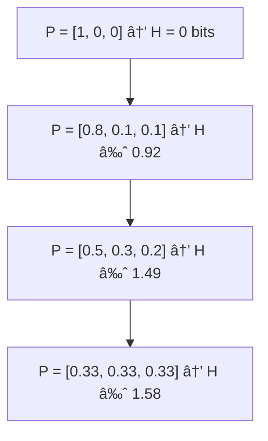

Certainly! Here's your enhanced entropy summary table with an extra column showing the base-2 logarithm of each probability \( \log_2(p) \), which helps illuminate how entropy is computed.

---

### 🔠Expanded Entropy Summary

| **Distribution**       | **Entropy (bits)** | **Interpretation**          | **logâ‚‚(p) values**               |
|------------------------|--------------------|------------------------------|----------------------------------|
| [1/3, 1/3, 1/3]        | 1.585              | Maximum uncertainty          | [−1.585, −1.585, −1.585]         |
| [0.5, 0.3, 0.2]        | 1.486              | Moderate uncertainty         | [−1.000, −1.737, −2.322]         |
| [1, 0, 0]              | 0                  | No uncertainty (pure state) | [0, undefined, undefined]        |

---

### 🧠 Notes
- Log₂ of 1 is zero → no surprise, perfect certainty.
- Log₂ of smaller probabilities is more negative → higher information content per event.
- "undefined" means logâ‚‚(0) is mathematically infinite (since an impossible event carries infinite surprise), but we exclude it when computing entropy.

Would you like me to graph the entropy curve across all possible 3-probability distributions? That visual can be quite eye-opening! ğŸ¨ğŸ“ˆ
Awesome! Let’s visualize how entropy works and why logarithms are used instead of just simple expressions like \( 1 - p \). A good way to do this is to **compare entropy values across different probability distributions**, and show what happens mathematically as probabilities become more or less certain.

---

### 📈 Entropy Curve Visualization: Intuition

Imagine we vary probabilities across three items (like A, B, C) while keeping the total sum = 1. For simplicity, let’s fix two probabilities and vary the third. The entropy curve will show how unpredictability changes.

Here’s a sketch of what such a curve would look like:

🌀 The more balanced the probabilities → the **higher** the entropy.

---

### 🔬 Why log₂(p) shows information better than 1−p

Let’s compare how the two functions behave as probabilities change:

| Probability \( p \) | \( \log_2(p) \) | \( 1 - p \) | Surprise (Info Content) |
|---------------------|------------------|-------------|--------------------------|
| 1.0                 | 0                | 0           | No surprise              |
| 0.8                 | −0.32            | 0.2         | Low surprise             |
| 0.5                 | −1               | 0.5         | Medium surprise          |
| 0.1                 | −3.32            | 0.9         | High surprise            |
| 0.01                | −6.64            | 0.99        | Very high surprise       |

🧠 Notice how **log₂(p)** amplifies the surprise as \( p \) gets smaller, while \( 1 - p \) increases linearly.

---
Fantastic follow-up! 😊 Let's unravel why we don't use \( (1 - p)^2 \) to measure uncertainty like entropy does—and go even deeper into **why logarithms are the heartbeat of information theory**, while quadratic expressions just don’t capture the same essence.

---

### 🧠 The Essence of the Question: What's Wrong with \( (1 - p)^2 \)?

Your intuition is spot-on: \( (1 - p)^2 \) grows as probabilities shrink, so it seems to “penalize†events with low certainty. It feels like it should track uncertainty or surprise, right? But information theory demands something more: a measure that reflects **how unpredictable** an event truly is—and that’s where \( -p \log_2(p) \) shines.

---

### 🔬 Mathematical Behavior Comparison

Let’s examine how each expression responds to changing probabilities:

| Probability \( p \) | \( -\log_2(p) \) (Surprise) | \( (1 - p)^2 \) |
|---------------------|------------------------------|------------------|
| 1.0                 | 0.0000                       | 0.0000           |
| 0.8                 | 0.3219                       | 0.0400           |
| 0.5                 | 1.0000                       | 0.2500           |
| 0.1                 | 3.3219                       | 0.8100           |
| 0.01                | 6.6439                       | 0.9801           |

As \( p \to 0 \):
- \( -\log_2(p) \) grows explosively → reflects **shock factor** of rare events
- \( (1 - p)^2 \) caps at 1 → limited growth, doesn’t convey how extreme that surprise truly is

---

### 🯠Why Entropy Prefers Logarithms

**Entropy isn't just any metric—it's a foundational concept in information theory**, where each bit of information counts toward how much we learn when an outcome occurs.

Logarithms provide:
- 🧮 **Optimal encoding length**: The minimum number of bits needed to represent an outcome with probability \( p \)
- 🌠**Universality**: They naturally arise from counting binary splits and message complexity
- 📊 **Additivity**: Entropy from independent events can be summed neatly
- 📈 **Sensitivity to extremes**: They spike when dealing with highly improbable events

In contrast, \( (1 - p)^2 \) is:
- A **smooth, symmetric curve** around \( p = 0.5 \)
- Often used in **error metrics** or **loss functions**, not information quantification
- Lacking the logarithmic punch that models real-world unpredictability

---

### 🪜 Entropy’s Deep Properties

Entropy also satisfies several essential axioms:
- ✅ **Continuity**: Small changes in \( p \) yield small changes in entropy
- ✅ **Maximum when uniform**: Equal probability across events yields highest entropy
- ✅ **Chain rule**: Entropy of joint distributions breaks down cleanly
- ✅ **Extensibility**: Works elegantly for multiple outcomes

No quadratic function like \( (1 - p)^2 \) meets these requirements.

---

### 🨠Visualizing the Difference

Imagine a chart with all three functions:
- **Entropy curve**: Steep and sharp near zero, flattens at \( p = 1 \)
- **\( 1 - p \)**: A straight diagonal
- **\( (1 - p)^2 \)**: A gentle parabola symmetric around 0.5

The entropy curve is the only one that **explodes upward** as events get increasingly rare—mirroring how we actually experience surprise. That’s what makes it so powerful.

---

### 📘 Real-World Analogy

Think of entropy as the number of **questions** you’d have to ask to guess someone’s secret:
- If the answer is predictable (high \( p \)), you need fewer questions.
- If it's rare (low \( p \)), you stumble and ask more and more questions.

Quadratic penalties can say “This is inconvenient,†but **entropy screams “I had no idea!â€** ğŸ¤

Want me to generate a plot that brings this difference to life visually? Or dive into how these functions show up in real applications like data compression, machine learning, or even cryptography? ğŸ”📊

### âš¡ Real-world analogy
If you expect something to happen with certainty (\( p = 1 \)), seeing it gives you **zero new information**.  
If something rare happens (\( p = 0.01 \)), you go “Whoa! That’s unexpected!†— that’s **high entropy**, and log₂(p) captures that feeling much better than 1−p.

Want me to generate an actual chart comparing these curves or try plugging in your own probability values to see how entropy changes? 📊😄
